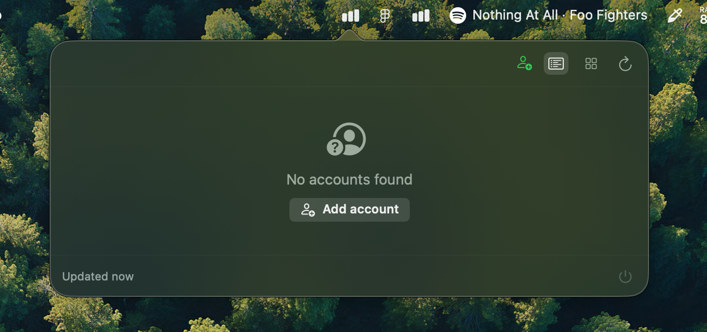
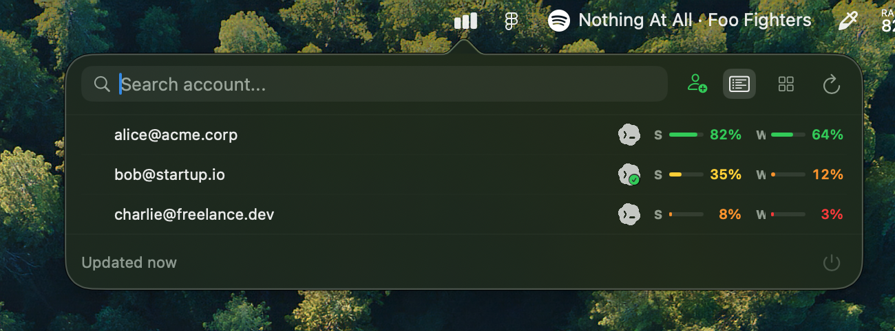
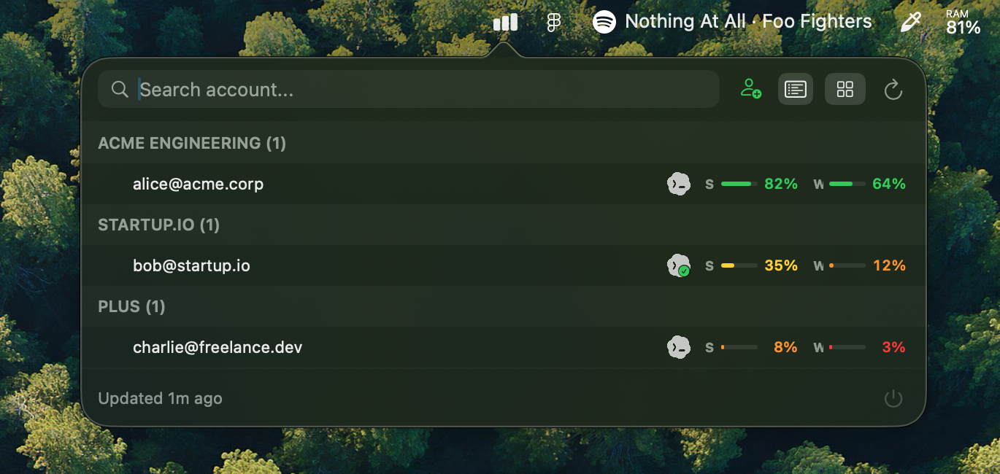
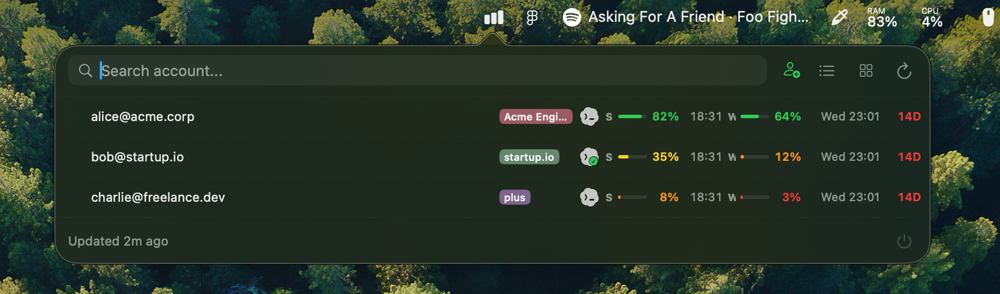

# Codex Switchboard: macOS Codex quota tracker and account switcher

<p align="center">
  
  
  
</p>

<p align="center">
  A local-first macOS menu bar app for OpenAI Codex quota tracking, multi-account switching, and workspace usage visibility.
</p>

<p align="center">
  
  
</p>

<p align="center">
  
  
</p>

---

## Overview

**Codex Switchboard** helps you track OpenAI Codex usage, monitor quota reset windows, and manage multiple Codex accounts and workspaces directly from your Mac menu bar.

- View best-effort Codex quota and usage across all your accounts
- Group accounts by workspace/team
- Add local display aliases so personal accounts are easy to identify
- Instantly see which account is active
- Switch active accounts with one click
- Identify invalid or deactivated accounts

> **Disclaimer:** Codex Switchboard is not affiliated with OpenAI. It does not change Codex/OpenAI limits, share accounts, or automate account cycling. It only helps you view local usage state and manually switch between accounts you control.

## Features

- **Codex Quota Dashboard** — Best-effort usage tracking across all linked accounts
- **Workspace Grouping** — Accounts organized by team/workspace
- **Display Aliases** — Local-only account labels for easier scanning while preserving the real email for auth and copy actions
- **Account Health** — Visual indicators for invalid or deactivated accounts
- **One-Click Switching** — Change your active Codex account instantly
- **Automatic Token Refresh** — Expired access tokens are refreshed locally when possible before asking you to re-login
- **Local-First** — All data stays on your machine; no cloud sync
- **Secure Token Storage** — Sensitive files written with `0600` permissions
- **Smart Ordering** — Accounts are implicitly ranked by a composite score so the "best account to use now" surfaces to the top

## Smart Ordering

Codex Switchboard automatically re-orders your accounts so the best one to use right now appears first.

- **Smart score** — `min(sessionFree, weeklyFree)`; the account with the highest bottlenecked balance wins.
- **Priority strip** — Accounts with useful balance whose weekly window resets in less than 24 hours get a temporary urgency boost and appear in a dedicated top section.
- **Exhausted accounts** — Sorted by who resets first, so you know which one will be usable again soonest.
- **Free reset group** — Free-plan accounts waiting for session reset are grouped separately so daily-use paid/workspace accounts stay easier to scan.

## Requirements

- macOS 13 (Ventura) or newer
- [Codex.app](https://github.com/openai/codex) installed in `/Applications/Codex.app` (for account switching)

## Installation

### Option 1: Installer Package (Recommended)

Download the latest `.pkg` from [Releases](../../releases), double-click to run the installer, and Codex Switchboard will be installed to `/Applications`.

### Option 2: Build From Source

```bash
git clone https://github.com/vyctorbrzezowski/codex-switchboard.git
cd codex-switchboard
swift test
swift build
./build-app.sh
open dist/CodexSwitchboard.app
```

### Building the Installer

To generate a `.pkg` installer from the built app:

```bash
./build-app.sh
./build-pkg.sh
```

The installer will be created at `dist/CodexSwitchboard-<version>.pkg`.

## Data & Privacy

Codex Switchboard is local-first and never syncs tokens or exposes a remote service.

### Local Files

| Path | Purpose |
|------|---------|
| `~/Library/Application Support/CodexSwitchboard/accounts.json` | Account list |
| `~/Library/Application Support/CodexSwitchboard/profiles/<profile>/auth.json` | Profile tokens |
| `~/Library/Application Support/CodexSwitchboard/profiles/<profile>/meta.json` | Profile metadata |
| `~/Library/Application Support/CodexSwitchboard/accounts-snapshot.json` | Usage snapshots |
| `~/Library/Application Support/CodexSwitchboard/team-name-cache.json` | Team name cache |
| `~/Library/Application Support/CodexSwitchboard/backups/<timestamp>-remove-account/` | Backups before removal |

All sensitive files are written with `0600` permissions. Removal actions create backups before deleting profile data.

### Network Calls

The app uses your local Codex/OpenAI auth tokens to query:

- `https://chatgpt.com/backend-api/codex/usage`
- `https://chatgpt.com/backend-api/accounts/check/v4-2023-04-27`
- `https://auth.openai.com/oauth/authorize`
- `https://auth.openai.com/oauth/token`

These are not official public APIs and may change without notice.

### Security

- Bearer tokens are never logged or transmitted to third parties
- OAuth callback server binds only to `localhost:1455` and closes immediately after login
- See [SECURITY.md](SECURITY.md) for the full threat model

## FAQ

### Does Codex Switchboard work with OpenAI Codex?

Yes. Codex Switchboard is built for local OpenAI Codex account usage visibility and manual account switching on macOS.

### Does it track Codex quota and reset windows?

It shows best-effort Codex usage and reset timing from the local app using your existing Codex/OpenAI auth state. The underlying endpoints are not official public APIs and may change.

### Does it switch Codex accounts automatically?

No. Codex Switchboard does not automate account cycling. It only changes the active local Codex account after an explicit manual action.

### Does it upload tokens or account data?

No. Codex Switchboard is local-first and does not sync tokens, account data, or usage snapshots to a third-party service.

## Contributing

Issues and pull requests are welcome. Please keep changes local-first, avoid token logging, and run `swift test` before opening a PR.

See [CONTRIBUTING.md](CONTRIBUTING.md) for guidelines.

## License

[MIT](LICENSE)
